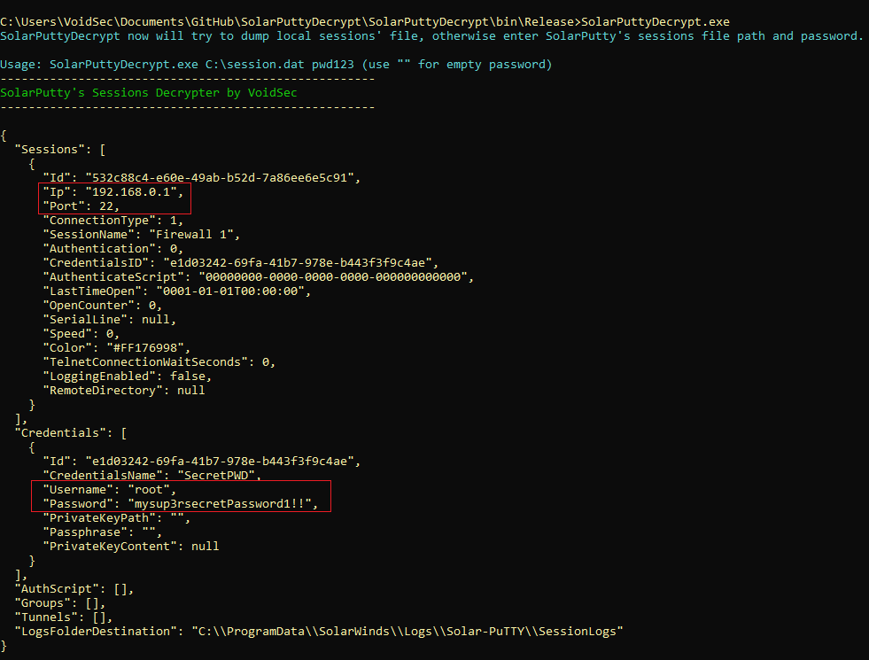

# SolarPuTTYDecrypt
A post-exploitation/forensics tool to decrypt SolarPuTTY's sessions files

*Author:* Paolo Stagno ([@Void_Sec](https://twitter.com/Void_Sec) - [voidsec.com](https://voidsec.com))

## Intro:

In September 2019 I found some bad design choices (vulnerability?) in SolarWinds [SolarPuTTY](https://www.solarwinds.com/free-tools/solar-putty) software. It allows an attacker to recover SolarPuTTY's stored sessions from a compromised system.

This vulnerability was leveraged to targets all SolarPuTTY versions <= 4.0.0.47

I've made this detailed [blog post](https://voidsec.com/solarputtydecrypt/) explaining the "vulnerability".

## Usage:
By default, when runned without arguments, the tool attempts to dump the local SolarPuTTY's sessions file (%appdata%\SolarWinds\FreeTools\Solar-PuTTY\data.dat).

Otherwise the tool can be pointed to an arbitrary exported sessions file in the following way (use "" for empty password):
```
SolarPuttyDecrypt.exe C:\Users\test\session.dat Pwd123!
```
Sessions will be outputted on screen and saved into User's Desktop (%userprofile%\desktop\SolarPutty_sessions_decrypted.txt)



### Help Needed

Searching for someone interested into helping me adding the decryption routine to the [Metasploit post-exploitation module](solar_putty.rb).